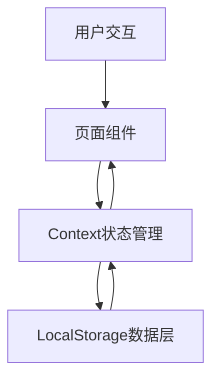

## 产品概述

余量与闲置资源共享平台是一个基于React + Vite的Web应用，帮助个人用户发布闲置物品和技能服务，实现资源再利用与价值重塑。

## 核心功能

- **闲置物品发布与浏览**：用户可以发布自己不再需要的物品，浏览他人发布的闲置物品，支持分类查看和搜索
- **技能服务发布与浏览**：用户可以发布自己的技能服务（如家教、设计、编程等），浏览他人提供的技能服务
- **资源详情页**：展示物品或服务的详细信息，包括描述、价格、图片、联系方式等
- **发布功能**：用户可以发布闲置物品或技能服务，包含标题、描述、价格、分类、图片上传（本地base64）等
- **收藏功能**：用户可以收藏感兴趣的物品或服务
- **搜索与筛选**：支持关键词搜索和分类筛选

## 技术栈

- 前端框架：React 18 + TypeScript
- 构建工具：Vite
- 样式方案：Tailwind CSS
- 路由：React Router v6
- 状态管理：React Context + useReducer
- 数据存储：LocalStorage（Demo数据持久化）

## 技术架构

### 系统架构

- 架构模式：分层架构（展示层、业务逻辑层、数据层）
- 组件结构：App根组件 → 页面组件 → 可复用UI组件
- Mermaid图表展示数据流向：

### 模块划分

- **UI组件模块**：可复用的卡片、表单、按钮、导航栏等组件
- **页面模块**：首页、物品浏览页、技能服务浏览页、详情页、发布页、收藏页
- **状态管理模块**：全局Context用于管理资源数据、用户收藏、筛选状态
- **数据持久化模块**：LocalStorage封装，用于存储和读取资源数据

### 数据流

用户操作（发布/浏览/收藏） → React状态更新 → 组件重渲染 → LocalStorage同步

## 设计风格

采用现代简约风格，结合清新自然的色调，营造友好、温暖的闲置交易氛围。使用卡片式布局展示资源，配合微动效提升交互体验。整体设计注重实用性同时保持视觉美感，符合资源共享平台的调性。

## 页面规划

1. **首页** - 展示精选资源和快捷入口
2. **物品浏览页** - 闲置物品列表，支持分类和筛选
3. **技能服务页** - 技能服务列表，支持分类和筛选
4. **资源详情页** - 物品或服务的详细信息
5. **发布页** - 发布闲置物品或技能服务
6. **收藏页** - 用户收藏的资源列表

## 布局结构

- 顶部导航栏：Logo、搜索框、发布按钮、收藏入口、切换分类
- 主要内容区：卡片网格布局展示资源
- 底部导航（移动端）：首页、浏览、发布、收藏、我的

## Agent扩展

### Skill

- **web-artifacts-builder**: 创建React + Tailwind CSS + shadcn/ui的复杂Web应用
- 用途：构建多组件的React Web应用
- 预期结果：完整的React + Vite项目结构，包含页面组件和UI组件